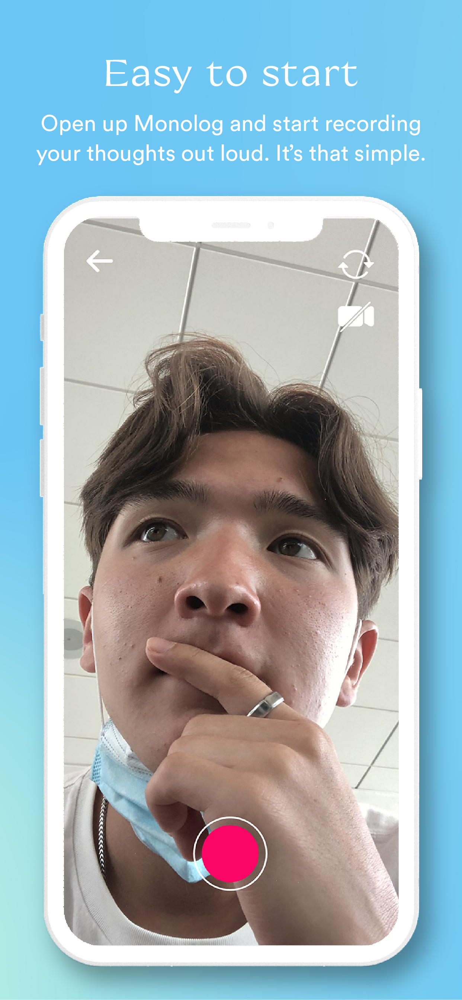
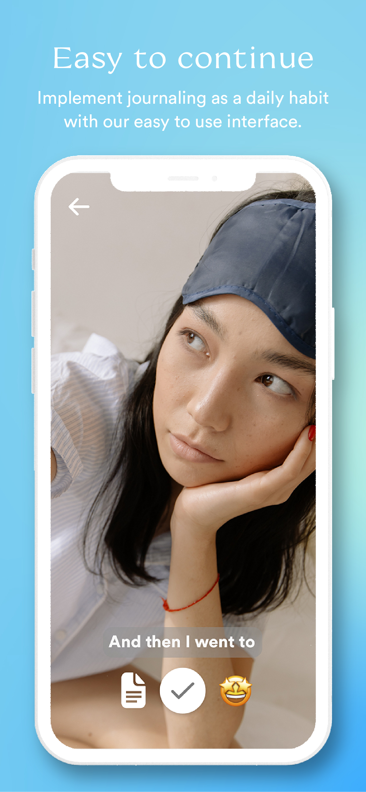
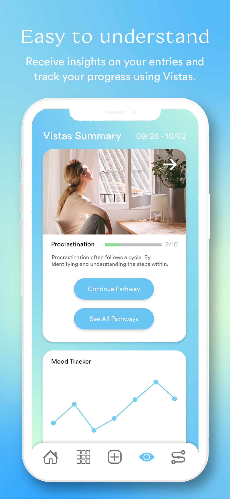
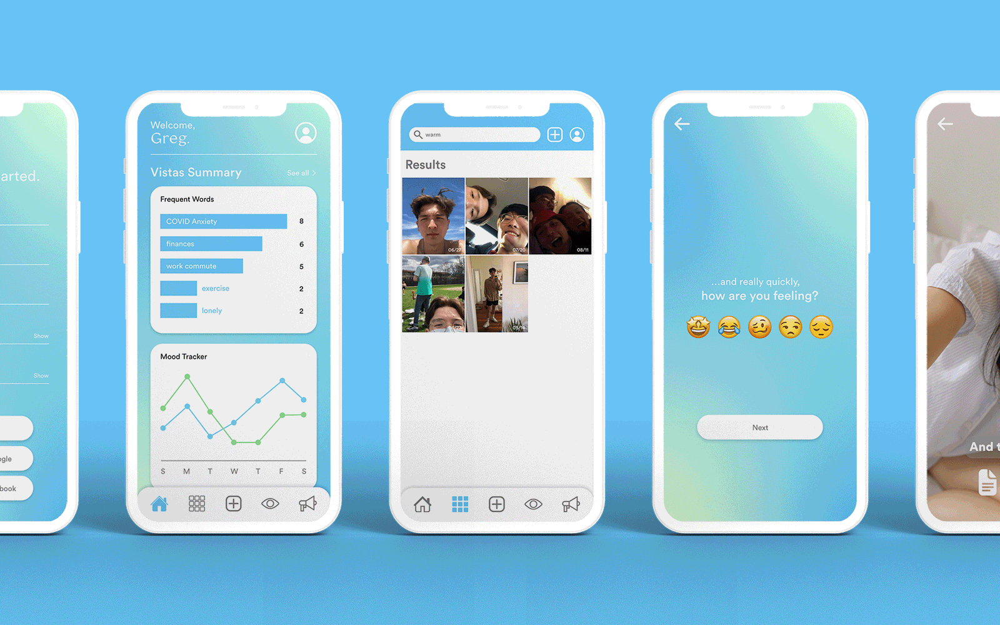

# Monolog

> Modernizing the journaling experience to improve holistic health.

**Monolog** is a mental health tech startup focused on building virtual, video-based journaling habits in users' daily lives. Our goal is not only to make journaling easier but to make it a habit as easy as drinking water every day. We believe in the amazing health benefits that come from practicing self-reflection on a daily basis.

## Monolog App

  
  
  

### Video Journaling
The Monolog app centers around **video journaling**, which we believe is an underused medium for capturing thoughts and emotions.

### Emotion Tracking
Users will select an emoji that reflects how they feel at exact moment after finishing a recording. We feel that this better captures mood and emotion compared to an arbitrary 1-5 scale, which many other apps use.

### Speech-to-Text Integration
During recording, the app uses speech-to-text technology to generate a transcript for each video journal entry. This text is displayed as live captions on future viewings and is fully editable, allowing users to correct any mistakes in the transcription.

## Vistas

After logging three video entries, the user gains access to **Vistas**: Monolog’s analytics and insights feature.

* **Word Chart:** Keeps track of how many times you mention a word or phrase in your entries, and displays these frequent words back to you, prompting the user to acknowledge repeating stressors.
* **Mood Tracker:** Tallies how you’re feeling after each entry, displaying a graph of your highs and lows from the past week.

  

## Privacy

Monolog was designed with a privacy-first mindset. 

* Monolog does not store any journal media or text in the cloud.
* All text processing is done using local AI models.
* No journals that users post or create will leave their local device.   